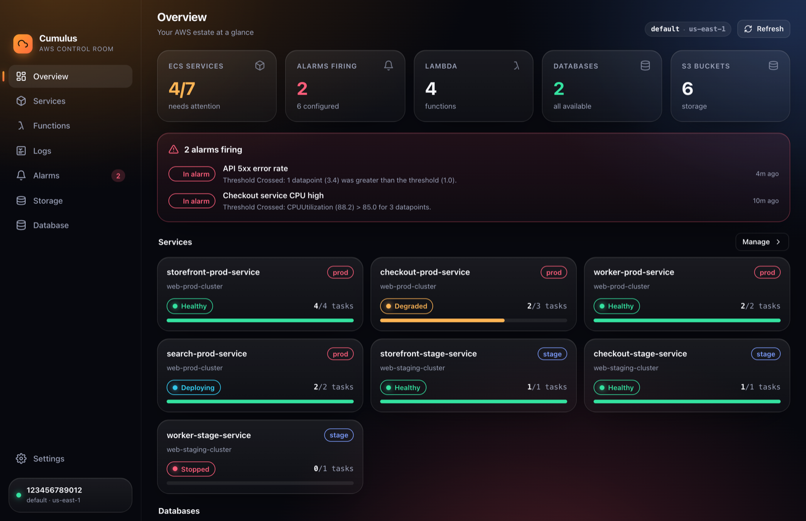
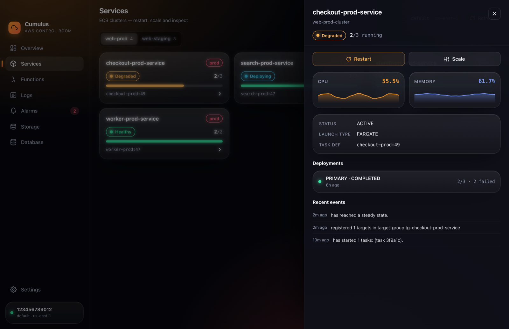
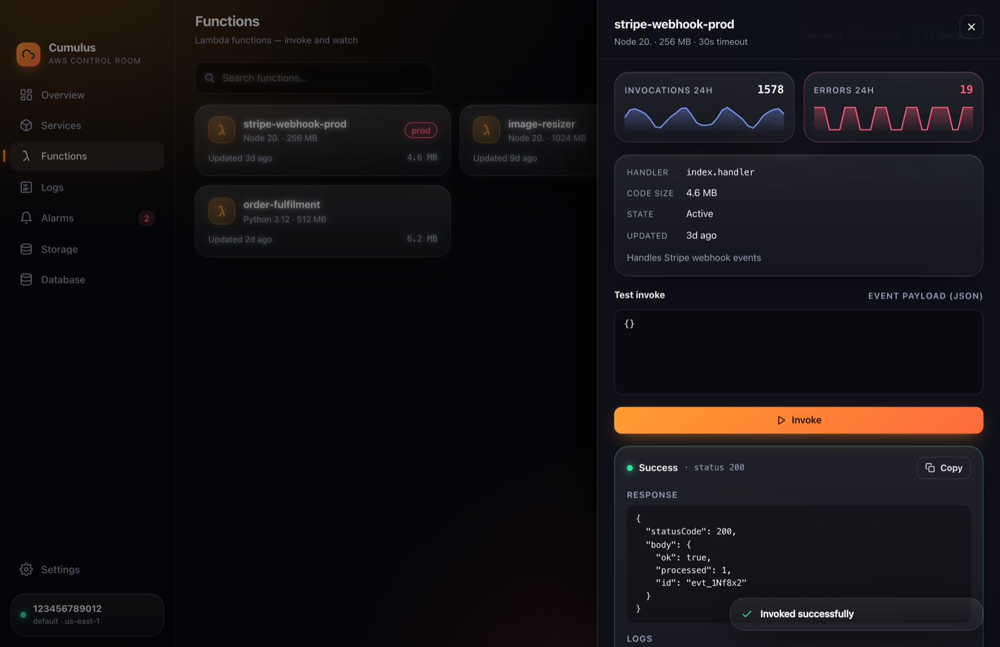
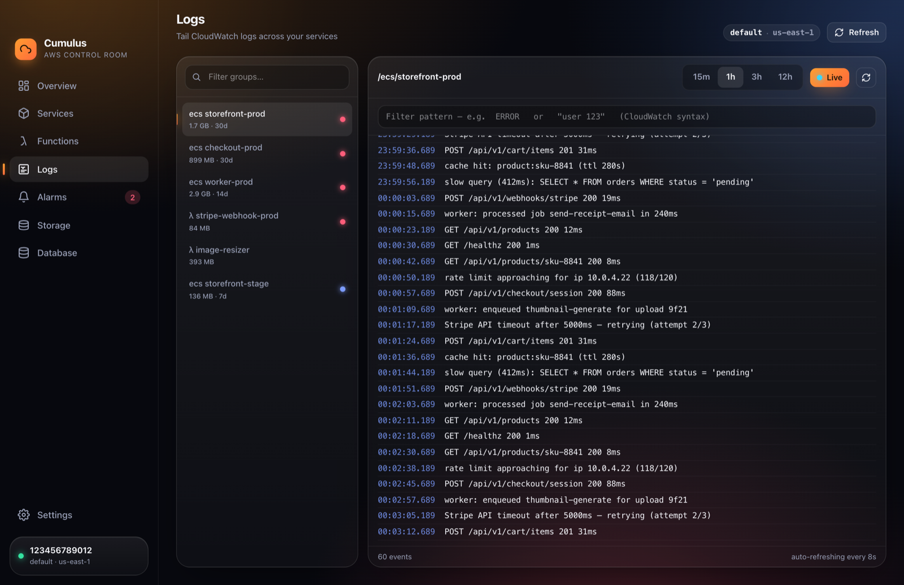
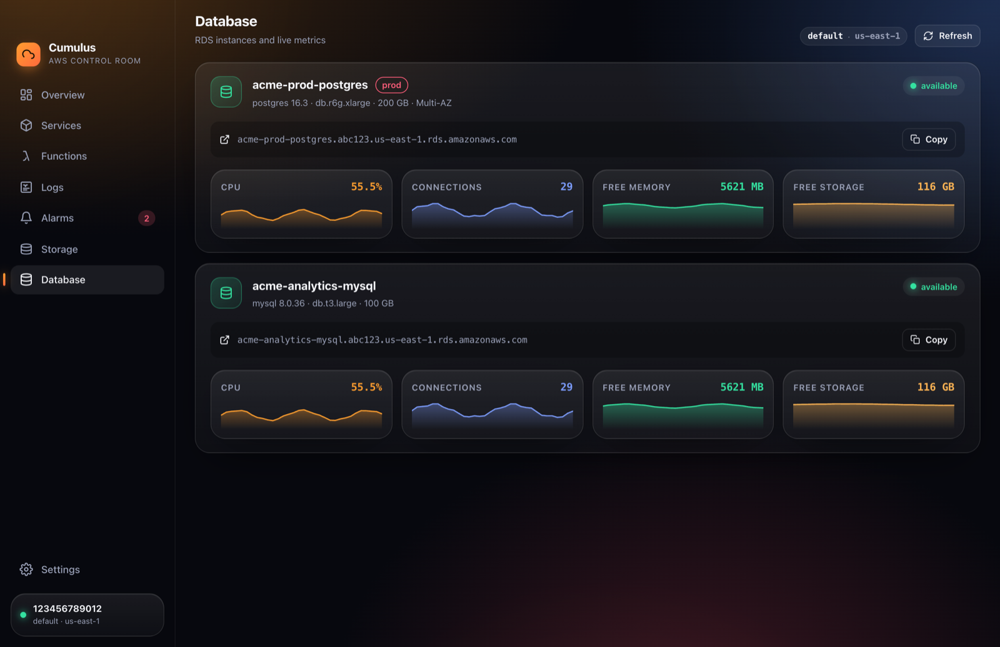
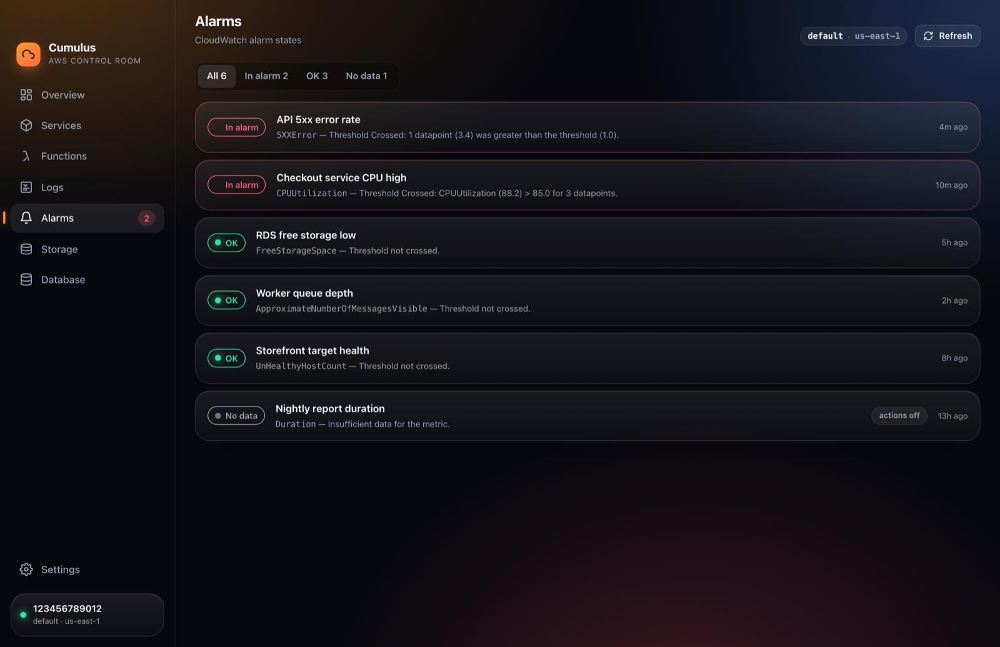
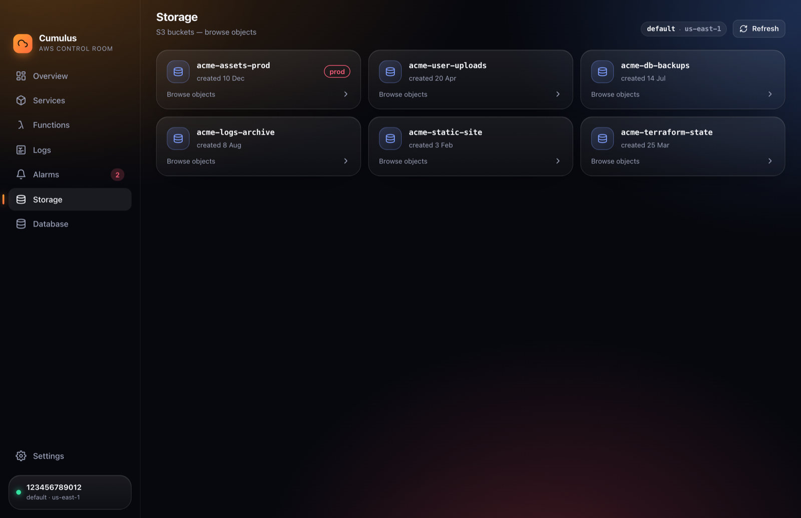

<div align="center">

# ☁️ Cumulus

**A native AWS control room for your desktop.**
Monitor and manage ECS, Lambda, CloudWatch, S3 and RDS — without ever opening the AWS console.

[](https://github.com/benoneill66/cumulus/releases/latest)
[](https://github.com/benoneill66/cumulus/releases)
[](LICENSE)


### [⬇&nbsp; Download for macOS](https://github.com/benoneill66/cumulus/releases/latest)

<br/>



</div>

---

Cumulus is a Tauri 2 + React desktop app with a thick native-glass macOS
aesthetic. It shells out to your existing `aws` CLI, so it inherits your
credential chain (including SSO refresh) and shows your real infrastructure the
moment you launch it.

> _Screenshots below use built-in demo data — running Cumulus without AWS
> credentials shows a fictional account so you can try the UI instantly._

## Screenshots

<table>
  <tr>
    <td width="50%"><b>Services — restart, scale &amp; live metrics</b><br/></td>
    <td width="50%"><b>Lambda — test-invoke &amp; watch</b><br/></td>
  </tr>
  <tr>
    <td><b>Logs — live CloudWatch tail</b><br/></td>
    <td><b>Database — RDS live metrics</b><br/></td>
  </tr>
  <tr>
    <td><b>Alarms</b><br/></td>
    <td><b>Storage — S3 browser</b><br/></td>
  </tr>
</table>

## What it does

| Section | What you get |
| --- | --- |
| **Overview** | Whole-estate health: ECS service health, alarms firing, Lambda/S3/RDS counts. |
| **Services** (ECS) | Clusters & services with running/desired tasks, deployments and events. **Restart** (force new deployment) and **Scale** (set desired count) inline. Live CPU/memory sparklines. |
| **Functions** (Lambda) | Every function with runtime/memory/size. **Test-invoke** with a JSON payload and see the response + log tail. 24h invocation & error charts. |
| **Logs** | A proper live CloudWatch log tail — pick a group, choose a time range, add a filter pattern, and watch it stream with severity colouring. |
| **Alarms** | Every CloudWatch alarm, in-alarm first, with state and reason. |
| **Storage** (S3) | Browse buckets and objects with breadcrumb navigation. |
| **Database** (RDS) | Instance status, endpoint, and live CPU / connections / memory / storage. |

## Download

Grab the latest `.app` from the **[Releases page](https://github.com/benoneill66/cumulus/releases/latest)** (Apple Silicon). It's unsigned, so clear the quarantine flag once after moving it to `/Applications`:

```sh
xattr -dr com.apple.quarantine /Applications/Cumulus.app
```

Prefer to build from source? See below.

## Requirements

- macOS, the [AWS CLI v2](https://docs.aws.amazon.com/cli/) configured (`~/.aws`)
- [Rust](https://rustup.rs) + [Bun](https://bun.sh) _(only to build from source)_

## Run it

```sh
bun install
bun run app          # dev, with hot reload
bun run dev          # browser-only preview with demo data (no AWS needed)
```

Pick your profile and region in **Settings**. SSO profile? Hit **Sign in with
SSO** and Cumulus runs `aws sso login` for you.

## Install to /Applications

```sh
bun run install-app  # release build → /Applications/Cumulus.app
```

## How it's wired

- `src-tauri/src/awscli.rs` — the async `aws` CLI runner (region/profile/JSON).
- `src-tauri/src/commands.rs` — one Tauri command per operation.
- `src-tauri/src/models.rs` ⇄ `src/lib/types.ts` — matching data shapes.
- `src/views/*` — one screen each, loading via the `useAsync` hook.

## Security

Cumulus is a local desktop tool. It has no backend, no telemetry, and stores no
credentials — it shells out to your own `aws` CLI and inherits whatever identity
and IAM permissions your active profile has. The only network traffic is the AWS
API calls the CLI already makes on your behalf.

It can perform **write actions** — restarting/scaling ECS services and invoking
Lambda functions — so run it with a profile whose permissions you're comfortable
exercising. There is nothing account-specific baked into this repo; everything
(accounts, clusters, functions, buckets) is discovered at runtime.

## License

MIT — see [LICENSE](LICENSE).
